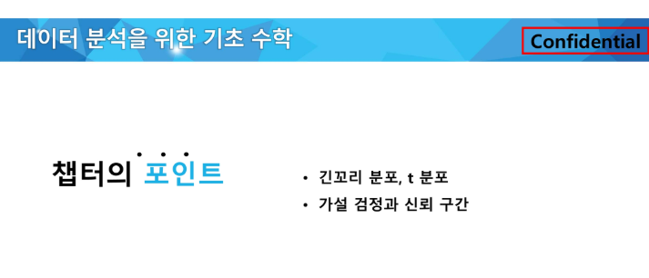

# [강의] 데이터사이언스 기초 : 데이터 분석을 위한 수학 및 통계2

lectures clone: Yes
날짜: 2025년 9월 16일
실습(과제): No
출석: No

통계통계 ~



# 긴꼬리분포, t분포

## 정규분포의 한계점

- 현실금융데이터(주식, 환율 등)는 완벽히 정규분포를 따르지 않는다
- 특히! 금융시장에서는 극단적인 상황(급등/급락)이 발생할 확률이 정규분포가 예측하는 것보다 더 높다
- “긴꼬리현상”


긴꼬리현상


QQ-plot으로 봤을 때 정규분포를 벗어남

## **긴꼬리분포**

데이터분포가 특정 방향으로 길게 늘어져있다. 


왼쪽그림: **분포가 왼쪽으로 몰려있고 오른쪽으로 긴 꼬리가 늘어진 형태가 되**면 - **평균**이 중앙보다 **크다.** 

- 대부분의 데이터가 작은 값 근처에 분포하지만, **일부 데이터는 매우 큰 값**으로 나타남 (Long-tail 효과).
- 예시: 인터넷 트래픽, 금융 시장 변동성, 고객 대기 시간 등 여러 현실 세계 데이터에서 발견됨.

- 예시1: 영상이 대부분 낮은 조회수지만 가끔씩 매우 높은 조회수가 나타남 / 사학과는 가난하지만 이재용회장이 있어서 확 커짐
- 예시2: 주식 시장의 붕괴: 블랙스완이론 - 주식시장의 붕괴와 같은 이례적인 사건이 정규분포로 예측되는 것보다 훨씬 더 자주 일어날 수 있다고 예측됨.

```python
"""
np.random.exponential(scale=2, size=1000)
- 평균(기대값)이 2인 지수 분포에서 1000개의 난수를 생성함.
**- 지수 분포는 긴 꼬리를 가지는(right-skewed) 비대칭적인 분포를 형성함.**
- "Long-tail Distribution"이란 데이터를 보면 극단적으로 큰 값이 나올 확률이 낮지만, 완전히 배제되지 않는 특징을 가짐.
"""
```


```python
- QQ-Plot(Quantile-Quantile Plot)이란?
  → "데이터가 특정 분포(여기서는 정규 분포)를 따르는지를 확인하는 그래프"
  → X축: 정규 분포의 이론적인 분위(Quantile) 값
  → Y축: 실제 데이터의 분위 값
  → 만약 데이터가 정규 분포를 따른다면, 점들이 대각선 직선 형태로 배열됨.
  → 정규 분포가 아닐 경우, 점들이 직선에서 벗어나거나 곡선을 형성함.
```


QQ-plot에서 점들이 상위분위에서 직선에서 크게 벗어나는 패턴을 보인다

: 지수분포가 정규분포를 따르지 않는다는걸 확인할 수 잇다. 


3년간의 달러-원 환율 데이터를 불러와서…

1. 종가데이터만 선택
2. 퍼센테이지로 바꿔준다
3. num값을 제거해준


실습1


실습2


## t분포


정규분포와 유사하지만 꼬리부분이 더 두꺼운 확률분포

→ 극단적인 값이 나올 확률이 정규분포보다 높다. 

표본크기가 작은 경우, 정규분포 대신 쓸 수 있다. - 정규성을 가정해야하는 것들이 있는데, 그때 t분포를 이용해서 쓴다. 

**♠️ 특징**

- 표본개수가 작거나 모집단의 표준편차를 정확히 모를 때 자주 사용함
- 꼬리가 더 두껍다
- 자유도란? — 데이터를 가지고 얼마나 자유롭게 움직일 수 있는지를 나타내는 수
    - 데이터 안에서 선택할 수 있는 자유~
    - 자유도가 작을수록 꼬리가 두꺼워지고 / 자유도가 커질수록 정규분포와 비슷해진다.
    - 예: 평균이 10이 되야하는 숫자 n개가 있다… 3개가 있다고 가정하고 하나의 수가 10이라면… 우리는 나머지 2개의 숫자만 움직일 수 있다 → 그럼 우리의 자유도는 2, n-1이다. 라고 볼 수 있다~

```python
# 1. t-분포를 따르는 난수 생성
data_t = np.random.standard_t(df=10, size=1000) #  표본 개수가 11

"""
np.random.standard_t(df=10, size=1000)
**- 자유도(df=10)를 가지는 t-분포에서 1000개의 난수를 생성함.**
- t-분포는 정규 분포와 비슷하지만, 양쪽 꼬리가 더 두꺼움 (극단값이 더 많이 발생).
**- 자유도(df, degree of freedom)가 클수록 정규 분포와 가까워짐.**
```

*`표본크기가 30개 이상일 경우, 표준정규분포와 비슷한 분포를 이룬다.*


**⭐ 금융분석에서 t분포의 중요성**

- **표본의 크기가 작은 경우가 많고** (최근 한 달 간의 수익률 데이터 등)
- **극단적인 수익률**(큰 폭락, 폭등 등)이 빈번하게 나타남

**✅ t분포의 금융적 활용**

- 작은 표본에서의 신뢰구간
- 가설 검정
- 리스크 관리

**💰 실제 금융 데이터를 통한 비교 시각화**

: 환율(달러/원)의 최근 20일 수익률 데이터(작은표본) 사용


<aside>

💰 가상금융데이터를 통한 비교시각화

- 극단적인 수익률이 자주 나타남
- 작은 표본을 이용할 때 더 넓고 현실적인 신뢰구간을 제공한다!
</aside>

# 가설검정과 신뢰구간

어떤 현상을 보고 차이가 있다, 효과가 있다 ← 이런 것들을 말할 때, 이 주장을 뒷받침해줄 수 있는 근거가 필요하다. 어떤 데이터를 가지고 설득을 할 필요가 있다. 


우리는… 애가 아니니까. 


## 통계적 실험의 중요성

직관이나 경험을 기반으로 결정하면 - 잘못된 결론을 내릴 위험이 크다

예1: 💊 신약개발 - 신약의 효과를 확인하려면 임상실험(통계적 실험)을 통해 비교 검증

예2: 🧛‍♀️마케팅 광고 효과 분석 - 통계적 실험(A/B 테스트)를 통해 광고효과를 검증해야 정확한 결론을 내림

## 유의성 검정의 중요성

**우리가 관측한 차이가 우연히 발생했을 확률**

예: 💊신약개발


신약의 효과가 진짜 있는건가? 단순히 평균만 비교해서는 차이가 커보이지 않는다

→ 이 차이가 “우연이 아닐 확률”을 계산해야 한다

: 유의성 검정을 수행해서 p-value가 0.05보다 작다면 “우연이 아닐 확률”이 높다 = 신약이 효과가 있다. 

## 가설설정개념

가설: 특정 주장을 검증하기 위한 가정

통계적 검저의 핵심: 이 가설이 맞는지 아닌지 검증하는 과정

- ***️⃣ 귀무가설**: 차이가 없다. 효과가 없다. (현상유지)
    - 귀: 돌아갈 귀
    - 무: 없을 무
    - ‘무’의 상태로 돌아간다. 변화가 없다.
- ***️⃣ 대립가설**: 차이가 있다. 효과가 있다 (내가 주장하고 싶은 것) (변화의 유효성) (내가 증명하고 싶은 것)

귀무가설을 부정할 수 있을 만큼의 증거가 있냐 - 기본 용의자는 무죄라고 가하고, 이 사람이 무죄가 아니라는거를 확실히 증명할 수 있는 대립가설의 증거가 필요한거임. 

## 신뢰구간

모집단의 참된 평균(모수)를 포함할 것으로 예상하는 값의 범위

표본에서 얻은 평균을 기반으로, 모집ㄷ안의 평균이 어느 범위 안에 있을지를 추정하는 방법

예제: 새로운 마케팅 전략이 구매고객률을 평균 2-5% 증가시킬 것이다. 

즉 95%의 확신을 가지고, 구매율 증가 범위는 2-5% 사이라고 말할 수 있다. 

신뢰구간과 가설검정관계


## 유의수준

우리가 허용할 “우연한 결과”의 최대 확률

귀무가설이 맞는데도 틀렸다고 말할 확률을 5%로 제한하겠다- 라는 의미

즉, 1종 오류를 5% 이내로 제한하겠다는 의미다. 

유의수준을 낮출수록 더 엄격한 검정을 수행하지만 2종 오류위험이 증가한다. 

## p-value

귀무가설이 참이라고 가정했을 때, 현재 관측된 결과보다 극단적인 결과가 나올 확률

이 차이가 단순한 우연일 가능성이 얼마나 되는지를 나타낸다

p-value가 작을수록 우리가 관측한 차이가 우연일 가능성이 낮아짐 


## 가설 검정

데이터를 기반으로 특성 가설이 맞는지 판단하는 과정

표본데이터를 이용해 모집단의 특성을 추론하는 방법


데이터수집 - 데이터 전처리 - 정규성 검정 - 가설 검정 - 결과 해석


## 유의성 검정의 유형


단측검정 vs 양측검정

- 단측검정: 특정 방향으로 차이가 있는지를 검정
- 양측검정: 방향 고려없이 단순히 차이가 있는지 검정

<aside>

양측 검정 결과:
t-통계량: -4.5129, p-value: 0.0000
귀무가설 기각 → A구와 B구의 승용차 이용률 차이가 유의미함

단측 검정 결과 (A구 < B구):
t-통계량: -4.5129, p-value: 0.0000
귀무가설 기각 → A구의 승용차 이용률이 B구보다 유의미하게 낮음

</aside>


## ◾ 정규성 검정

데이터가 정규분포를 따르는지 확인하는 과정

통계적 검정(t-검정, ANOVA)을 수행하기 전에 정규성 가정을 만족하는지 확인하기 위한 가정

- Shaprio-Wilk Test: 소규모 표본(50개 이하)에 적합하다.

### Shaprio-Wilk Test

귀무가설: 데이터는 정규분포를 따른다

대립가설: 데이터는 정규분포를 따르지 않는다

p-value≤ 0.05: 귀무가설 기각 - 정규성이 없다

p-value≥0.05: 귀무가설 유지 - 정규성 만족

즉 p-value가 0.05보다 크면 데이터가 정규성을 만족한다고 판단 가능. 


## ◾ t-검정

**두 집단의 평균 차이가 통계적으로 유의미한지 검정하는 방법**

모집단의 평균을 비교하는 검정 방법

데이터가 정규성을 만족해야 한다

표본수가 적더라도 비교적 정확한 결과를 제공한다

<aside>

귀무가설: 두 집단의 평균이 같다 (차이가 없다)

대립가설: 두 집단의 평균이 다르다 (차이가 잇다)

</aside>

- 독립표본 t- 검정
- 대응표본 t-검정

### 독립표본 t-검정

서로 독립적인 두 집단의 평균 비교

- 서로 다른 집단의 평균 차이를 비교
- 두 집단이 서로 독립적이며 관측값이 중복되지 않음
- 데이터가 정규성을 만족함

예시:

가도시와 나도시의 승용차 이용률의 차이?

새로운 강의에서 남학생과 여학생의 성적에 차이를 미치는지 검정

두 개의 브랜드에서 제공하는 고객 서비스 만족도가 차이가 있는지 검정


**정규성 검정** - 정규성을 만족함

**등분산 검정** - (이런게잇다~정도만 알면됨 이해까지는 ㄴ)

Shapiro-Wilk test (A구): p-value = 0.6868
Shapiro-Wilk test (B구): p-value = 0.9130
Levene’s test: p-value = 0.6223

**t-검정 수행 -** 

등분산을 가정한 독립표본 t-검정 수행
t-통계량 = -4.5129, p-value = 0.0000
두 집단의 평균 차이가 유의미함 (귀무가설 기각)

p-value가 매우 작게 나온다 - 통계적으로 유의미하다는 걸 알 수 있다!


### 대응표본 t-검정 개념

**같은 집단에서 두 시점** 또는 두 조건에서의 평균 차이를 비교

- **같은 개체에서 두 번 측정 된 데이터를 비교할 때 사용**
- 이전 상태와 이후 상태 사이의 평균 차이가 유의미한지 검정
- 집단 간 비교가 아니라 같은 개체에서 변화가 있는지 변화 비교

<aside>

여튼 독립표본은 걍 나누는데 대응표본은 random으로 나눈다 이유가 뭐지…

강의를 들어보자. 

</aside>

**구 주민들의 교통정책 시행 전과 후 승용차이용률 변화 비교

동일한 학생들의 새로운 교육 프로그램 수강 전후 성적 차이 분석

한 브랜드의 서비스 개선 전후 고객 만족도 차이 검정


```jsx
# 정규성 검증
Shapiro-Wilk test (정책 시행 전): p-value = 0.6868
Shapiro-Wilk test (정책 시행 후): p-value = 0.7563
두 그룹 모두 정규성을 만족함

# 대응표본 t-검정 수행
t-통계량 = 9.5365, p-value = 0.0000
정책 시행 전후 속도 차이가 유의미함 (귀무가설 기각)
```


🌊 🦀 

