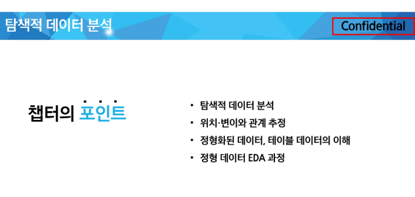

# [강의] EDA : 탐색적 데이터 분석

lectures clone: No
날짜: 2025년 9월 18일
실습(과제): No
출석: No

**데이터사이언스 기초 : EDA**

# **EDA:  Exploratory Data Analysis**

데이터를 살펴보고 **데이터를 이해**하기 위한 첫 과정

문제 정의, 데이터 수집

🔽

데이터분석절차

🔽

탐색적 데이터 분석

데이터 가공

모델 구현

모델 해석

모델 제출

**데이터에 대한 이해**가 중요하다 

# 위치, 변이와 관계 추정

- 대표값
- 얼마나 퍼져있는지

⭐변수별 상관 관계 분석은 필수적이다!

# 정형화된 데이터, 테이블 데이터의 이해

- 수치형 데이터
- 범주형 데이터

데이터를 분석하고 예측을 모델링할 때, 시각화, 해석, 모델 결정 등에 데이터의 종류가 중요한 역할을 한다. 

## 🪑 테이블 데이터

⭕ 테이블 데이터

- DataFrame
- Feature - 각 열
- Output
- Record

# 정형 데이터 EDA 과정

(1) 데이터 확인

(2) Feature