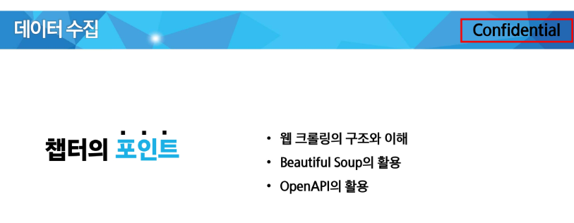

# [강의] 데이터 수집

lectures clone: No
날짜: 2025년 9월 19일
실습(과제): No
출석: No



# 🟦 웹 크롤링의 구조와 이해

사람 - 브라우저 열고 - 웹페이지 확인하고 - 복사, 붙여넣기 등등…

웹크롤링: **인터넷 상의 웹페이지를 자동으로 탐색하고 데이터를 수집하는 기술**

◼️ **특징**

- 자동화
- 대량 데이터 수집
- 구조화된 데이터 추출

(스크래핑: 특정 웹페이지에서 원하는 데이터(텍스트, 이미지, 표 등)을 추출하는 과정) 

(엄밀히 말하면 스크래핑과 웹크롤링은 다르지만 혼용되서 자주 사용됨)

## ◼️ **웹데이터 수집 방법**

- **스크래핑**: 웹 페이지를 가져와서 필요한 정보만 추출하기
- **크롤링**: 웹 드라이버를 이용해 웹 브라우저 자동화 하기 (동적인 데이터를 다룰 때)
- **제공된** OpenAPI를 이용해 실시간으로 데이터 가져오기 (공공, 네이버카카오, 금융 등…)

**(1) 웹페이지에서 데이터 추출**

보통 정적의 웹페이지는 HTML을 중심으로 이루어져있다

원하는 주소의 웹페이지로 들어가 - HTML 내용을 가져오고 - **그 안에서 원하는 데이터가 어디 있는지 가져오는 작업 (parsing)**

파이썬에서는 **뷰티풀스프 라이브러리**를 주로 사용한다. 


**(2)공개된 Open API 사용하기**


**(3) 웹브라우저 자동화**

코드로 제어를 하기

프로그래밍코드로 조작하게 만든다

URL만으로 접속할 수 없는, 세션유지가 필요한 작업같은건 - 정적이 페이지에서 안뜰수도있는건 - 자동화를 해서 쓰기

파이썬에서 selenium 라이브러리를 사용


**(4) 기타 고급 작업**


## 웹페이지 구조

HTML, CSS, JavaScript의 조합으로 구성되어있음

여기서 우리가 웹크롤링을 통해 얻고자 하는 데이터는 HTML의 어딘가에 들어있다 - HTML의 구조를 알아야 하고, 이런 데이터를 뽑아내서 원하는 형태로 가공하는 작업(파싱)을 거쳐야 한다. 


건물의 뼈대와 인테리어, 구성 예쁘게

◼️ **HTML 기본 구성 요소**

<오픈태그> 컨텐츠 </클로징태그>  ←- 이 전체를 하나의 엘리먼트로 바라본다. 

`<p> Hyper Text Markup Language </p>`

속성attribute - 해당 요소에 추가적인 내용을 담고 싶을 때… (글자색, 크기, 배경색, 배경이미지, 여백 등…>

`<p align = ‘center’>Hello, HTML!</p>`


<html>

<head>

<title>

<body>


웹크롤링을 할 때는 이런 태그 구조를 잘 파악해서 우리가 원하는 정보가 어떤 태그 안에 있는지 찾아내는 것이 핵심!

liv, sapn, a, tr, td 등등…


## CSS 기본 문법

웹크롤링에서 css선택자를 활용하기 때문에 살펴보고 넘어가겠습니다 


(좌)

html태그 이름 그대로 선택하는 방식 tm

html구조(웹페이지 구조)가 트리형식으로 나타나있다

최상위: html

아래: 바디

아래: h1 및 p

그 아래: 웹이나 하이퍼텍스트 등이 들어가있다…

(우)

p{ }라는 이름을 가진 모든 html태그의 글자색은 빨간색이 될 것이다. 

크롤링입장에서 타입선택자를 활용한다는 것:

[soup.select](http://soup.select)(’p’) < 페이지에 있는 모든 p태그들을 한번에 가져오겠다는 의미가 된다

원래 타입선택자는 스타일용인데 크롤링에서도 같은 태그를 가진 모든 요소를 한번에 수집하는 역할을 수행한다

사실상 html태그 이름 그대로 선택한다고 볼 수 있다. 


고유한 값


여러 요소에 스타일이 적용

좌측 두 개를 한번에 가져올 수 있음 


자식요소만 가져온다

중첩된 요소를 안가져올 수 도 있다. 


세 번째 자식에게만 적용하겠다. 

## Robots.txt

웹사이트소유자가 검색엔진의 웹크롤러가 사이트의 특정 부분을 크롤링하거나 인덱싱하는 것을 허용하거나 차단하기 위해 사용하는 텍스트 파일


# 🟦 뷰티풀 수프의 활용싱

**정적인 크롤링에 최적화 된 라이브러리**


[https://www.youtube.com/results?search_query=오렌지캬라멜](https://www.youtube.com/results?search_query=%EC%98%A4%EB%A0%8C%EC%A7%80%EC%BA%AC%EB%9D%BC%EB%A9%9C)


```python
import requests

url = 'http://mysnu.ac.kr'
html = requests.get(url).text

title_begin = html.index('<title>')
title_end = html.index('</title>')
title = html[title_begin : title_end]

print(title)

>> <title>Portal basic index
```

```python
import requests

code = '005930'
url = 'https://finance.naver.com/item/main.nhn?code='
html = requests.**get(url + code)**.text

title_begin = **html.index('<title>')**
title_end = **html.index('</title>')**
title = html[title_begin : title_end]

print(title)

>> <title>삼성전자 : 네이버페이 증권
```

## 뷰티풀스프

```markdown
### BeautifulSoup으로 식단 정보 추출하기
https://snuco.snu.ac.kr/foodmenu 페이지의 점심 식단 데이터를 추출하는 코드입니다.
```

```
import requests
from bs4 import BeautifulSoup

url = 'https://snuco.snu.ac.kr/foodmenu'
html = requests.get(url).text
bs = BeautifulSoup(html)
print(bs)
```

```python
<!DOCTYPE html>
<html lang="ko-KR">
<head id="snu_head">
<meta content="IE=edge" http-equiv="X-UA-Compatible"/>
<meta charset="utf-8"/>
<meta content="width=device-width, initial-scale=1" name="viewport"/>
<link href="http://gmpg.org/xfn/11" rel="profile"/>
<script src="//developers.kakao.com/sdk/js/kakao.min.js"></script>
<meta content="index, follow, max-image-preview:large, max-snippet:-1, max-video-preview:-1" name="robots"/>
<link href="https://snuco.snu.ac.kr/en/foodmenu/" hreflang="en" rel="alternate"/>
<link href="https://snuco.snu.ac.kr/foodmenu/" hreflang="ko" rel="alternate"/>
<!-- This site is optimized with the Yoast SEO plugin v23.1 - https://yoast.com/wordpress/plugins/seo/ -->
<title>식단 - 서울대학교 생활협동조합</title>
<link href="https://snuco.snu.ac.kr/foodmenu/" rel="canonical"/>
<meta content="ko_KR" property="og:locale"/>
<meta content="article" property="og:type"/>
<meta content="식단 - 서울대학교 생활협동조합" property="og:title"/>
<meta content="식단 &lt;알림&gt; 원활한 식당 이용을 위하여 운영 및 혼잡 시간을 참고 부탁드립니다. ※학생회관식당, 제3식당, 기숙사식당, 302동식당, 동원관식당, 자하연식당(총 6개소) 비구성원은 +1,000원 (#) NO MEAT : 주메뉴 기준 표기사항입니다." property="og:description"/>
<meta content="https://snuco.snu.ac.kr/foodmenu/" property="og:url"/>
<meta content="서울대학교 생활협동조합" property="og:site_name"/>
<meta content="2025-03-26T08:26:12+00:00" property="article:modified_time"/>
<meta content="summary_large_image" name="twitter:card"/>
<meta content="예상 되는 판독 시간" name="twitter:label1"/>
<meta content="1분" name="twitter:data1"/>
<script class="yoast-schema-graph" type="application/ld+json">{"@context":"https://schema.org","@graph":[{"@type":"WebPage","@id":"https://snuco.snu.ac.kr/foodmenu/","url":"https://snuco.snu.ac.kr/foodmenu/","name":"식단 - 서울대학교 생활협동조합","isPartOf":{"@id":"https://snuco.snu.ac.kr/#website"},"datePublished":"2023-12-15T01:46:16+00:00","dateModified":"2025-03-26T08:26:12+00:00","breadcrumb":{"@id":"https://snuco.snu.ac.kr/foodmenu/#breadcrumb"},"inLanguage":"ko-KR","potentialAction":[{"@type":"ReadAction","target":["https://snuco.snu.ac.kr/foodmenu/"]}]},{"@type":"BreadcrumbList","@id":"https://snuco.snu.ac.kr/foodmenu/#breadcrumb","itemListElement":[{"@type":"ListItem","position":1,"name":"Home","item":"https://snuco.snu.ac.kr/"},{"@type":"ListItem","position":2,"name":"식단"}]},{"@type":"WebSite","@id":"https://snuco.snu.ac.kr/#website","url":"https://snuco.snu.ac.kr/","name":"서울대학교 생활협동조합","description":"Just another SNU Sites site","potentialAction":[{"@type":"SearchAction","target":{"@type":"EntryPoint","urlTemplate":"https://snuco.snu.ac.kr/?s={search_term_string}"},"query-input":"required name=search_term_string"}],"inLanguage":"ko-KR"}]}</script>
...
</style>
</body>
</html>

Output is truncated. View as a scrollable element or open in a text editor. Adjust cell output settings...
```


**겉보기에는 별 변화가 없지만, 현재 bs객체에는 이미 HTML의 정보가 뷰티플스프를 통해 해석되어 있다. 예를 들어서 `print(bs.title)`처럼 title을 쉽게 출력할 수 있음.** 


**점심 메뉴만 추출 (class 사용)**

[`bs.select](http://bs.select)(’td.lunch’)`


점심 메뉴 첫 번째 항목만 추출

`bs.select(’td.lunch’)[1]`


텍스트만 추출 (공백 포함됨)

`bs.select('td.lunch')[1].text.strip().split('\n')[0].replace('\r', '')`


<aside>

우리가 필요로 하는 데이터를 어떤 것을 가져올 것인가, 그 데이터가 어떻게 가져와지고 어떻게 잘라서 쓸건지 생각하면서 잘 쓰기

데이터를 가져와서 파싱하는 것

그것들이 (파싱할 때) 어떻게 생성되는지는 모를 때는 f12를 통해 잘 확인해보고, 잘모르겟으면 copy selector눌러서 잘하기

</aside>

# 🟦 OpenAPI의 활용

오픈API: 누구나 사용할 수 있도록 공개된 API

웹사이트가 가진 기능을 모두가 이용할 수 있도록 공개한 프로그래밍 인터페이


서버: 데이터 보관 및 제공사 (raw 데이터) 

user: 사용자 - 서버한테 데이터 요청 및 응답을 받음 (데이터 활용)

이 응답을 서비스나 애플리케이션에 적용해서 새로운 서비스를만듬


## 1. XML


## 2. CSV


## 3. JSON


## 4. 기타 다양터


## 공공데이터포털의 OpenAPI 사용 절차 용


플랫폼형태에서 검색할 수 있게 구성해두고… 서버랑 이용자랑 연결해준다~ 


인증키를 활용합시다 ~~ 받아둡시다 ~~ 


