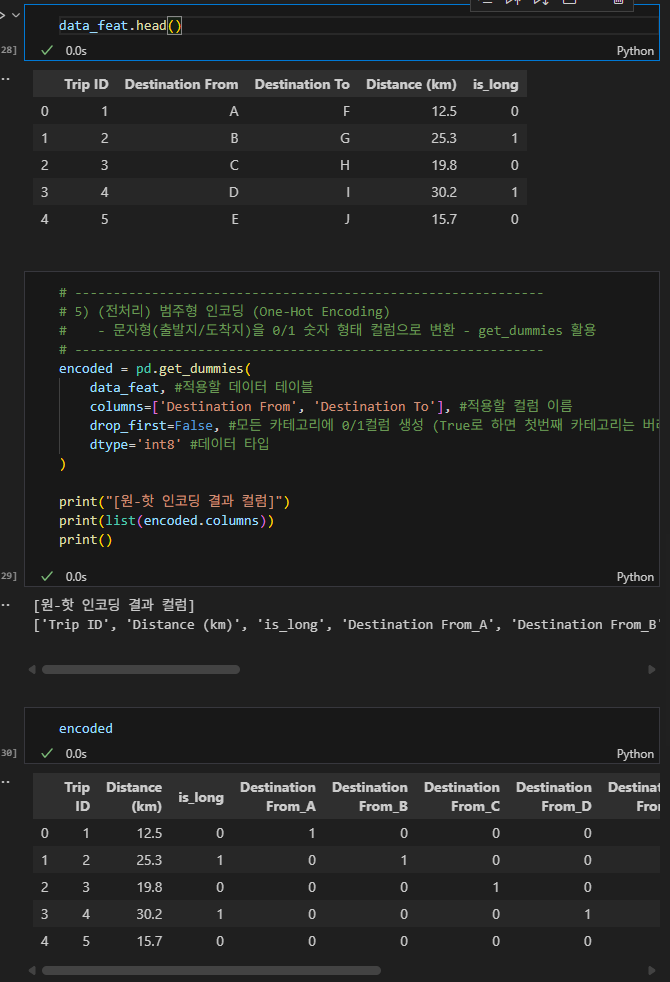

# 불필요한 컬럼 제거 drop
```data_cleaned = data.drop(columns = ['Age', 'Car Color'])```

원하는 컬럼만 선택해서 drop가능
drop(coloums = ['c1', 'c2', ..., 'cn'])


# loc
열만 가져오기: ```df[칼럼이름]```

열 - loc 사용: ```df.loc[ 범위1:범위2, 칼럼이름]```

행 - loc 사용: ```df.loc[행이름]```도 사용 가능


# ```data_feat['is_long'] = (data_feat['Distance (km)'] >= THRESHOLD_KM).astype(int)```
장거리 여부를 0 또는 1로 표시해서 집계, 비율 확인을 쉽게 만듬. 
이때 **각 조건 여부를 달성하는지 여부에 대해** ```astype()```함수를 써서 True/False를 정수인수로 만들었다. 

=> 타입을 명확하게 명시함


# get_dummies 함수
특정 컬럼들에 대해 원-핫 인코딩을 진행해주는 함수
c1 컬럼에 a,b,c값이 있다고 하고 이걸 get_dummies함수를 실행하면 c1_a, c1_b, c1_c로 나뉘어서 표현됨 -> 범주형 문자열 데이터를 숫자화해서 머신러닝 모델에 바로 넣을 수 있도록 가공하는 과정
