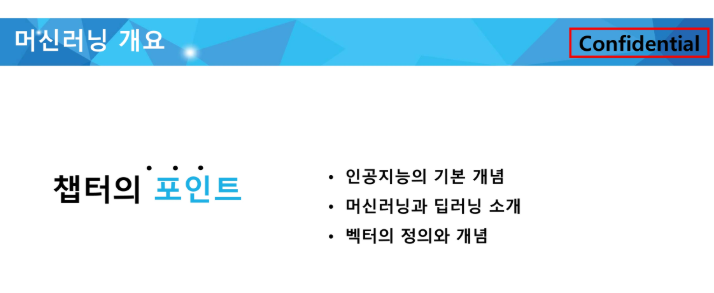

# [강의] 머신러닝 개요 및 평가지표_과목평가

lectures clone: Yes
날짜: 2025년 9월 23일
실습(과제): Yes
출석: Yes

**데이터사이언스 활용 : 머신러닝 개요 및 평가지표**

학습이라는 과정을 거치고 - 어떻게 평가할지? 

# 🟦 인공지능의 기본 개념

인공지능 - 머신러닝 - 딥러닝… 

인공지능: 인간의 지능을 인공적으로 만든 것

- 인공지능 - 규칙 기반의 알고리즘 *🧑사람이 일일이 규칙*
- 머신러닝 - 데이터 기반의 학습 *🤖이메일이 스팸인지아닌지.. 데이터 내 패턴을 찾아내서 학습*
- 딥러닝 - 인공신경망을 여러개 깊게 쌓은 것

**퍼셉트론** 사람이 가지고 있는 뇌를 본떠서 만듬

입력층 - 은닉층 - 출력층 

# 🟦 머신러닝과 딥러닝 소개

머신러닝

**컴퓨터가 명시적으로 프로그래밍되지 않아도 스스로 학습할 수 있는 능력을 부여하는 학문 분야**

(데이터, 과거의 사례)를 통해 (해결하려는 문제, 과제)작업에 대한 성능이 (얼마나 잘했는지 평가기준)으로 측정한 결과 향상되는 경우 

**경험을 쌓고 그걸 통해 성능이 올라간다면 그것이 바로 머신러닝이다.** 

데이터를 통해 과제를 더 잘 수행하도록 성능이 향상되는 과정

## 🔧 Feature Engineering

모델이 더 좋은 예측을 할 수 있도록 **데이터를 가공하는 과정**

데이터를 단순히 수집하는 것보다 **적절한 피처(변수)를 만드는 것**이 성능 향상에 더 중요하다. 

(덜중요한건 제거하거나, 더 중요한걸 합친 변수를 만들어도 동작이 더 잘된다면… 더 좋은 엔지니어링일지도?)

(**모델이 잘 이해할 수 있게 조합, 정리 등등 처리를 해서 제공**하겠다~)

⭐ 모델

⭐ 피처 ←도 중요하다~

(딥러닝보다는 특히 머신러닝에서 중요하다~)

**🔧 피처 선택**

- 상관계수 분석 - 높으면 제거 - 비슷한 정보를 가지고 있을 테니까
- 분산(퍼짐의 정도) - 변화가 거의 없다 - 모델학습에 큰 기여를 하지 않을 수도 있다
- Recursive Feature Elimination - 모델 성능에 가장 중요한 변수 선택 (과적합 방지 등…)

**🔧 피처 생성**

기존 데이터를 활용해 새로운 변수를 만들 수도 잇음

예: 가격 * 판매량 = “매출”

예: 날짜데이터에 요일이나 주말여부, 계절같은 변수를 추가할 수 있다.

**🔧 피처 변환** 

**🔧 범주형 데이터 인코딩**

문자 데이터를 숫자로 변환하여 **모델이 이해할 수 있도록 한다**

- 원-핫 인코딩: 순서가 없는 형태로 변환 - red [1,0,0] blue [0,1,0] green [0,0,1]
- 라벨 인코딩: 레드, 그린, 블루 ~ 0,1,2 이런식으로

**🔧 결측값 처리**

**🔧 이상치 처리**

z-score, IQR 기반 이상치 제거 등등

로그변환

## 🤖 머신러닝 학습방법

- 지도학습 - 정답이 존재하는 데이터를 학습 (스팸메일)
- 비지도학습 - 정답이 없다. 군집형태로 묶어주는 형태.
- 강화학습- 어떤 행동을 하면 보상 💰을 준다 (알파고)

~ 준지도학습(일부데이터만 라벨링), 자기지도학습(스스로학습 - GPT, BERT 등) 

### (1) 지도학습 🏠 📈

입력과 정답이 함께 주어지 데이터 셋

집변적, 대지크기 방의개수 등등등… → 집가격 예측 

2차원 그래프

3차원 공간

.

.

n차원 예측가능함 풀수있음 

but 고차원은 밀도가 희박해짐 

(연산도 많아지고 힘들어서 차원축소방법도 같이씁니당~ )

🖥️

이미지분류

객체 위치 지정 및 탐

🗨️

번역하는 함수

문자쌍이 존재하고 

이미지, 텍스트 등에서 지도학습은 다양하게 쓰일 수 있다~

### (2) 비지도학습 **🧬**🪢

데이터에 정답(라벨)이 없다. 

좌: 정답이 있음 (하우스, 타운하우스) / 우: 정답이 없음. 데이터의 구조나 패턴을 스스로 찾아야햄

데이터에서 흥미로운 구조를 찾쟝

**🧬 유전자 클러스터링** 🪢

엄청나게 많은 유전자 데이터 중 패턴을 보고 비슷한 특성을 가진 애들끼리 묶기 

라벨이 존재하지않는 상태에서 클러스터를 구성해서 비슷한 애들끼리 묶는다 

### (3) 자기지도학습 💰

요즘 많이 쓰이는 방법

자기자신이 학습을 위한 정답을 만들어내는 학습

말뭉치를 그냥 던져주면 데이터 내부 구조만으로 데이터 학습쌍을 자동으로 생성한다. 

말뭉치를 가지고 계산한 애들… 태스크들에 대해 파인튜닝을 해서 추가적인 학습을 시켜서 어떻게저쩧게 쓰인다고 합니당

### (4) 강화학습 ⚫ ⚪

순차적인 결정을 내리는 학습

어떤 행동이 들어옴 - 리워드를 받음 - 이걸 바탕으로 전략을 개선해나간다 

피드백을 계속 수용해나가면서 고쳐나간다. 

## 과적합 vs 과소적합

좌: 과소적합 / 우: 과적합

과적합: 새로운 데이터에 대한 성능이 저하됨

과소적합: 모델이 충분히 학습되지 못함

## 💯 평가

모델이 얼마나 잘 예측하는지 알기위해서 - 실제값과 모델예측값을 비교해서 - 오차를 구함

오차를 줄이는 게 목표!

그치만 과적합을 주의하자~

- 예측/회귀
- 분류

관련 모델 자체는 예측회귀분류 다 쓰일 수 있음 (주로 쓰이는 곳이 잇을 뿐)

무슨 기준을 가지고 오차를 평가할건지 기준을 잘 세우고 그에 맞는 오차를 써야한다. 

### (1) MAE 평균 절댓값 오차

절댓값을 쓰기 때문에.. 실제 정답보다 낮게 예측… → 방향성을 알기는 어렵다. 

### (2) MAPE

오차를 실제값대비 백분율로 전환해줌

단위에 상관없이 해석 가능

주의: 실제값이 0에 가깝다고 하면 - 분모가 굉장히 작아짐 - 오차가 발산될 수 잇음(엄청 커질 수 있음)

방향성을 알 수도 없고

이상치에는 덜 예민할 수 있지만… 발산 가능성  o

### (3) MSE

제일 많이 쓰임

평균제곱오차

제곱하는 이유

(1) 부호를 없애서 - 오차가 클 수록 패널티를 주기 위함

(2) 

이상치에 민감 - 큰 오차에 큰 패널티가 주어진다. 

이상치가 많으면 mse보다는 mae를 고려해야 함

### (4) RMSE

mse에 루트를 씌워서 해석 여지를 줄임

이상치에 대한 패널티가 여전히 존재하지만 mse보다는 덜 민감하다

해석은 쉽다

### (5) R2 score

모델이 변동성을 얼마나 잘 설명하고 있는가 (설명력에 초점을 둠)

## 분류모델평가 방법

### 🔲 오차행렬

### 정확도

전체샘플 중 모델이 맞춘 비율

### 정밀도

참이라고 예측한 것 중 실제로 참인 비율 (예측이 맞는 비율) 

### 재현율

실제 참 중에서 모델이 맞춘 비율 (실제 정답 중 내가 맞춘 것) 

**precision과 recall의 trade off**

정밀도와 재현율은 반비례관계다. 

**정밀도를 / 재현율을 100%로 만드는 방법**

### f1-스코어

### ROC / AUC

AUC가 1에 가까울 수록 좋은 성능을 보인다

1. **TPR이란 모델이 실제 양성을 얼마나 잘 찾아내는지를 의미한다**
2. FPR이 **낮을수록** 좋은 모델이다
3. ROC곡선은 **FPR이 증가할 때 TPR의 변화**를 나타내는 그래프
4. AUC값이 **1에 가까울 수록 좋은 성능**을 가진 모델이다. 

*sklearn에서는 위에 언급된 정확도 정밀도 등을 바로바로 계산할 수 있는 함수를 제공해준다~* 

# 🟦 벡터의 정의와 개념

벡터: 크기와 **방향**도 가진다. 

