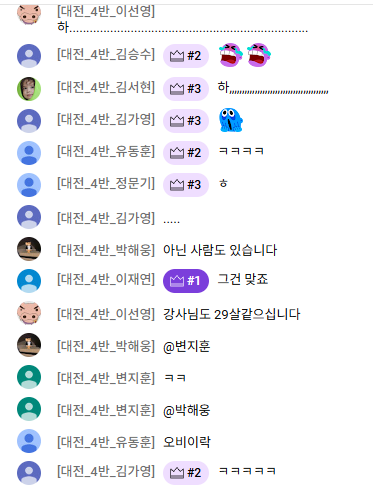

# [강의] 머신러닝 알고리즘1

lectures clone: No
날짜: 2025년 9월 24일
실습(과제): No
출석: No

**데이터사이언스 활용 : 데이터분석을 위한 머신러닝 알고리즘1**




# 🟦 선형변환 및 행렬 연산

**머신러닝과 데이터분석에서 행렬의 중요성**

- 데이터를 효율적으로 표현
- 데이터: 대부분 행렬형태로 저장
- 머신러닝 알고리즘: 선형회귀, 로지스틱 회귀, 신경망 등에서 가중치와 데이터 처리 연산 및 데이터 변형, 차원축소를 위해 행렬 사용
- 최적화 및 학습 과정: 경사하강법 등 최적화 알고리즘 및 딥러닝에서 미분과 행렬 연산 사용

## 🔹 행렬


### 행렬덧셈, 스칼라


```python
import numpy as np

A = np.array([[1, 2], [3, 4]])  # 2x2 행렬
B = np.array([[5, 6], [7, 8]])  # 2x2 행렬

C = A + B  # 행렬 덧셈
D = 2 * A  # 스칼라 곱

print(C)
print("=" * 50)
print(D)

>>
[[ 6  8]
 [10 12]]
==================================================
[[2 4]
 [6 8]]
```

### 행렬곱 dot


```python
import numpy as np

A = np.array([[1, 2, 3], [4, 5, 6]])
B = np.array([[7, 8], [9, 10], [11, 12]])

C = np.**dot**(A, B)  # 행렬 곱
print(C)

>>[[ 58  64]
 [139 154]]
```

### 전치행렬 transpose


```python
import numpy as np

# 원래 행렬 A (2x3)
A = np.array([[1, 2, 3],
              [4, 5, 6]])

# 전치 행렬 A^T (3x2)
A_T = A.**transpose**()

print("원래 행렬 A:")
print(A)
print("\n전치 행렬 A^T:")
print(A_T)

>>
원래 행렬 A:
[[1 2 3]
 [4 5 6]]

전치 행렬 A^T:
[[1 4]
 [2 5]
 [3 6]]
```

## 🔹 선형변환

공간을 변형시키는 규칙


없는게없는스캠조


### 크기변형 Scaling


## ✅ 선형변환 - 원점을 고정하자!


3씩 더하는건 변환이 아니라 그냥 순수 이동임

모든 벡터에 일정 값을 더하는 이동의 개념

선형변환은 원점이라는걸 보전해야하기때문에 이동을 하는 순간 원점이 변함 → 선형변환이 아님. 

# 🟦 Regression (회귀)

https://recipesds.tistory.com/entry/%EB%8F%84%EB%8C%80%EC%B2%B4-%EC%99%9C-%ED%9A%8C%EA%B7%80%EB%8A%94-%ED%9A%8C%EA%B8%B0%EB%9D%BC%EA%B3%A0-%EB%B6%88%EB%A6%AC%EB%8A%94-%EA%B1%B8%EA%B9%8C

그니까 회귀regression은 아버지랑 아들의 키의 상관관계를 연구할 때 ‘아 남자들의 키는 평균으로 돌아가는-회귀하는-성질이 있구나… 하고 아빠키→아들키 이런 독립→종속 관계를 연구했는데, 이게 사실은 틀렸지만 이 실마리 ‘회귀’라는게 남아서 걍 이름이 회귀인거임. 

이제 화장실에서 화장안하지만 옛날에는 정말 화장실에서 화장했어서 이름이 화장실인것처럼 하하하 🪞 


데이터를 기반으로 연속적인 값을 예측한다 

*회귀분석을 좀더 정확하게 얘기하면 변수들 간의 관계를 파악함으로써 어떤 특정한 변수의 값을 다른 변수들로 설명하고 예측하는 통계적 기법*

독립변수 → 종속변수 


## 선형회귀

입력변수와 출력변수간의 선형관계를 가정하여 예측하는 모델

데이터가 직선으로 표현될 수 있을 때, 가장 간단하고 직관적인 방법


다중의 피처가 있다 - 다중공선성이 있다 - 신뢰도가 낮아지고 예측이 안됨

예시: 수치적인것, 크기-가격, 비용-판매량 

파란점: 💙 선형회귀에서 예측한 선. 데이터의 전반적인걸 모델링한 직선.

보라점: 💜 실제 개별 데이터 포인트 

이제 이 둘 사이의 오차들을 계산해서 모델의 적합성을 계산함 (이때 이 오차들을 계산하는 식들이 다양하게 존재함 - 제곱을 하던(마이너스값도 있으니까), 평균을 내던….. 등등등)

scikit-learn 예

```python
# 필수 라이브러리 불러오기
from sklearn.model_selection import train_test_split
from sklearn.linear_model import LinearRegression
from sklearn.metrics import mean_squared_error, r2_score
from sklearn.datasets import fetch_california_housing
import pandas as pd

# 캘리포니아 주택 가격 데이터셋 로드
data = fetch_california_housing()
X = pd.DataFrame(data.data, columns=data.feature_names)  # 독립 변수(특징 데이터)
y = data.target  # 종속 변수 (중간 주택 가격)

# 주택 크기(House Size) 특성만 선택
X_house_size = X[['HouseAge']]

# 데이터를 학습용 및 테스트용 데이터로 분할
X_train, X_test, y_train, y_test = 
(
    X_house_size, y, test_size=0.3, random_state=42 #관용적으로 42라는 숫자를 마니 씀
)

# 선형 회귀 모델 학습
model = LinearRegression()
model.fit(X_train, y_train)

# 예측 수행
**y_pred = model.predict(X_test)**

# 모델 평가
mse = mean_squared_error(y_test, y_pred)  # 평균 제곱 오차 계산
r2 = r2_score(y_test, y_pred)  # 결정 계수(R²) 계산

# 결과 출력
print(f"Mean Squared Error (MSE): {mse:.2f}")
print(f"R² Score: {r2:.4f}")

>>
Mean Squared Error (MSE): 1.30
R² Score: 0.0107
```

## 다중회귀

여러개의 피처를 사용하는 회귀


각 입력변수에 해당하는 가중치를 곱해준 다음에 그 값을 모두 더하여 예측 값을 계산한다. 


X에서 특정 컬럼을 뽑는게 아니라 X전체를 사용한다 (다중선형회귀)

```python
# 필요한 라이브러리 임포트
from sklearn.model_selection import train_test_split
from sklearn.linear_model import LinearRegression
from sklearn.metrics import mean_squared_error, r2_score
from sklearn.datasets import fetch_california_housing
import pandas as pd
import matplotlib.pyplot as plt

# 캘리포니아 주택 가격 데이터셋 로드
data = fetch_california_housing()
**X** = pd.DataFrame(data.data, columns=data.feature_names)  # 특성 데이터
y = data.target  # 목표 변수 (중간 주택 가격)

# 데이터를 학습용 및 테스트용으로 분할
**X_train**, X_test, y_train, y_test = train_test_split(X, y, test_size=0.3, random_state=42)

# 선형 회귀 모델 학습
model = LinearRegression()
model.fit(X_train, y_train)

# 예측 수행
y_pred = model.predict(X_test)

# 모델 평가
mse = **mean_squared_error**(y_test, y_pred)  # 평균 제곱 오차 계산
	#실제값과 예측값 사이의 값을 계산한다. 
r2 = r2_score(y_test, y_pred)  # 결정 계수(R²) 계산

# 결과 출력
print(f"Mean Squared Error (MSE): {mse:.2f}")
print(f"R² Score: {r2:.4f}")

>>
Mean Squared Error (MSE): 0.53
R² Score: 0.5958
```

> (단일선형회귀)
> 
> 
> Mean Squared Error (MSE): 1.30
> R² Score: 0.0107
> 아까보다 훨씬 높아진 R^2스코어 → 훨씬 예측을 잘한다고 생각할 수 있음
> 

## 다항회귀

입력변수와 출력변수간의 **비선형관계**를 모델링하는 회귀방법


```python
# 필요한 라이브러리 임포트
from sklearn.model_selection import train_test_split
from sklearn.preprocessing import PolynomialFeatures
from sklearn.linear_model import LinearRegression
from sklearn.metrics import mean_squared_error, r2_score
from sklearn.datasets import fetch_california_housing
import pandas as pd
import numpy as np
import matplotlib.pyplot as plt

# 캘리포니아 주택 가격 데이터셋 로드
data = fetch_california_housing()
df = pd.DataFrame(data.data, columns=data.feature_names)  # 데이터를 DataFrame으로 변환
df["MedHouseVal"] = data.target  # 목표 변수(주택 가격) 추가

# 특정 특성 선택 (가구당 평균 방 개수)
X = df[["AveRooms"]]  # 독립 변수(특징)
y = df["MedHouseVal"]  # 종속 변수(주택 가격)

# 데이터를 학습용 및 테스트용으로 분할
X_train, X_test, y_train, y_test = train_test_split(X, y, test_size=0.3, random_state=42)

#============================위의 일반적인 회귀와 동일============================

**# 다항 특성 변환 (차수=2)
poly = PolynomialFeatures(degree=2)  # X를 [1, X, X^2] 형태로 변환 #2차식까지 
X_train_poly = poly.fit_transform(X_train)
	# fit_transform: 데이터의 특성에 맞춘다 
	# 학습train을 위한 과정에서 데이터에 대해 변형이 생기니까 
	# -특성에 맞춰서 fit하게 transform시킨다)
X_test_poly = poly.transform(X_test)
	#훈련용데이터는 fit할 필요가 없당**

# 다항 회귀 모델 학습
model = LinearRegression()
model.fit(X_train_poly, y_train)

# 예측 수행
y_pred = model.predict(X_test_poly)

# 모델 평가
mse = mean_squared_error(y_test, y_pred)  # 평균 제곱 오차 계산
r2 = r2_score(y_test, y_pred)  # 결정 계수(R²) 계산

# 결과 출력
print(f"Mean Squared Error (MSE): {mse:.2f}")
print(f"R² Score: {r2:.4f}")

>>
Mean Squared Error (MSE): 1.25
R² Score: 0.0502
```

# 🟦 베이즈 정리, 나이브 베이즈 ❓

스팸과 정상메일은 **독립사건**임 (별개의 문제, 스팸이 5개왓다고해서 다음에 스팸이 올 확률? 이런거 계산 못함 하하하)

이런거를 나이브베이즈 분류알고리즘을 활용할 수 있음


B가 발생했을 때 A가 발생할 확률

메일이 스팸일 확률을 계산해보자~

b: 메일에 ‘할인’이라는 키워드가 들어가있을 확률

a: 스팸일 확률

p(a|b) 할인이 들어있을 때 스팸일 확률


```python
# 전체 이메일 중 40%가 스팸
# 전체 이메일 중 60%가 정상 메일 
# 사전 확률 (Prior)
P_spam = 0.4  # 스팸 메일 확률
P_ham = 0.6   # 정상 메일 확률

# 단어별 조건부 확률 (각 단어가 특정한 메일에 포함될 확률)
# 예제 단어 (스팸 단어: "당첨", "무료", "혜택", 정상 단어: "회의", "보고서", "협조")
# ex) 당첨이 스팸 메일에서 등장할 확률이 12/30
P_당첨_given_spam = 12 / 30
P_무료_given_spam = 10 / 30
P_혜택_given_spam = 8 / 30

P_당첨_given_ham = 2 / 20
P_무료_given_ham = 3 / 20
P_혜택_given_ham = 1 / 20

**# 특정 이메일이 "당첨", "무료", "혜택"을 포함할 경우 확률 계산**
P_words_given_spam = P_당첨_given_spam * P_무료_given_spam * P_혜택_given_spam
P_words_given_ham = P_당첨_given_ham * P_무료_given_ham * P_혜택_given_ham

# 최종 확률 계산 (Posterior)
P_spam_given_words = P_words_given_spam * P_spam
P_ham_given_words = P_words_given_ham * P_ham

# 결과 출력
{
    "P(스팸 | 당첨, 무료, 혜택)": P_spam_given_words,
    "P(정상 | 당첨, 무료, 혜택)": P_ham_given_words,
    "결론": "정상 메일" if P_ham_given_words > P_spam_given_words else "스팸 메일"
}

>>
{'P(스팸 | 당첨, 무료, 혜택)': 0.014222222222222223,
 'P(정상 | 당첨, 무료, 혜택)': 0.00045,
 '결론': '스팸 메일'}
```

# 🟦 Classification류

🍔 📧

입력데이터가 여러 개의 카테고리 중 하나에 속하도록 지정하는 작업

주로 지도학습방식으로 이루어지며, 데이터의 특징을 기반으로 해당 데이터가 어느 범주에 속하는지를 예측하자. 


학습알고리즘은 함수 f를 생성하여 입력벡터 x가 어떤 카테고리 y에 속하는지를 예측한다

예: 이미지분류


분류: 범주 (이산적인 값) 

회귀: 예측 (연속적인 실수) 


## 분류 문제에 회귀알고리즘 적용하기


🛫 어떤 비행기가 뜰 때 지연여부를 확인할 때 풍속을 확인하고 싶다. 

특정 경계 이상이 되면 지연을 시킨다 ~ 를 바이너리 형태로 구분하고 싶다. 

## 로지스틱 회귀


회귀라는 이름을 가진 분류모델

0과 1 사이의 확률로 변환해서 이 값으로 분류를 하겠다 - 해석이 간단하고 계산이 빠르다

but 비선형 데이터에는 적합하지 않을 수 있다. 선형적일 때 효과적! 복잡한 결정경계를 만들기는 어렵다. 


```python
# 필요한 라이브러리 임포트
from sklearn.linear_model import LogisticRegression
from sklearn.metrics import accuracy_score
from sklearn.datasets import load_iris
from sklearn.model_selection import train_test_split

# 데이터셋 로드 (Iris 데이터셋 사용)
data = load_iris()
X = data.data  # 특성 데이터
y = data.target  # 목표 변수 (클래스 레이블)

# 데이터를 학습용 및 테스트용으로 분할
X_train, X_test, y_train, y_test = train_test_split(X, y, test_size=0.3, random_state=42)

# 로지스틱 회귀 모델 학습
model = LogisticRegression(max_iter=200)
model.fit(X_train, y_train)

# 예측 수행
y_pred = model.predict(X_test)

# 모델 평가
accuracy = accuracy_score(y_test, y_pred)  # 정확도 계산

# 결과 출력
print(f"Accuracy: {accuracy * 100:.2f}%")
```

## 결정트리 🌳

**조건**을 기반으로 데이터를 **분기**해서 **최종리프노드에서 예측결과**를 나타내게 함 


- 엔트로피
- 지니지수

5대5로 분리되어있는 불확실한 상태다

true만 1개고 false만 0개다 - 엔트로피가 낮다 - 순수하다 - 순도가 높다 라고 판단 가능

```python
# 필요한 라이브러리 임포트
from sklearn.tree import DecisionTreeClassifier
from sklearn.metrics import accuracy_score
from sklearn.datasets import load_iris
from sklearn.model_selection import train_test_split

# 데이터셋 로드 (Iris 데이터셋 사용)
data = load_iris()
X = data.data  # 특성 데이터
y = data.target  # 목표 변수 (클래스 레이블)

# 데이터를 학습용 및 테스트용으로 분할
X_train, X_test, y_train, y_test = train_test_split(X, y, test_size=0.3, random_state=42)

# 결정트리 모델 학습
model = **DecisionTreeClassifier**(random_state=42)  # 결정트리 모델 생성
model.fit(X_train, y_train)

# 예측 수행
y_pred = model.predict(X_test)

# 모델 평가
accuracy = accuracy_score(y_test, y_pred)  # 정확도 계산

# 결과 출력
print(f"Accuracy: {accuracy * 100:.2f}%")

```


# 🟦 KNN


```python
# 필요한 라이브러리 임포트
from sklearn.model_selection import train_test_split
from sklearn.neighbors import KNeighborsClassifier
from sklearn.metrics import accuracy_score
from sklearn.datasets import load_iris

# 데이터셋 로드 (Iris 데이터셋 사용)
data = load_iris()
X = data.data  # 특성 데이터
y = data.target  # 목표 변수 (클래스 레이블)

# 데이터를 학습용 및 테스트용으로 분할
X_train, X_test, y_train, y_test = train_test_split(X, y, test_size=0.3, random_state=42)

# KNN 모델 학습 (K=5로 설정)
model = KNeighborsClassifier(**n_neighbors=5**)
model.fit(X_train, y_train)

# 예측 수행
y_pred = model.predict(X_test)

# 모델 평가
accuracy = accuracy_score(y_test, y_pred)  # 정확도 계산

# 결과 출력
print(f"Accuracy: {accuracy * 100:.2f}%")
```