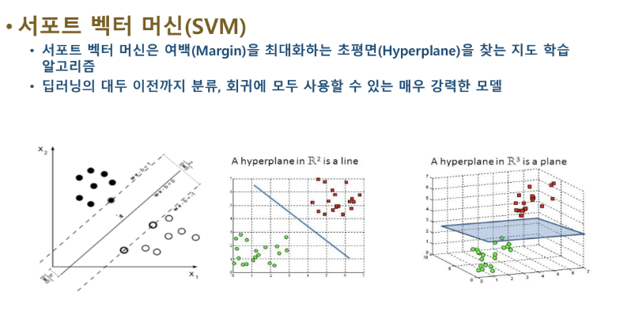

# [강의] 데이터분석을 위한 머신러닝 알고리즘2

lectures clone: Yes
날짜: 2025년 9월 25일
실습(과제): No
출석: No
태그: 강의, 데이터사이언스

**데이터사이언스 활용 : 데이터분석을 위한 머신러닝 알고리즘2**

# 🟦 SVM

## SVM이란?



두 그룹의 경계선을 찾으려는 모델

분류


원래 곡선으로만 나누던 데이터를 

고차원에서 평면으로 나눌 수 잇게 됨

차원을 바꾸는 형식으로 늘려서 선형분리를 수행할 수 있다. 

실제로 고차원으로 바꾸는게 아니라 고차원처럼 보이게 연산을 함 (커널 ’트릭’이라고 불리는 이유)

## 😀 ☹️


😀 데이터에 대한 이해가 낮아도 사용할 수 있는 모델이다

피처수가 많고 샘플수가 적을 때 사용이 용이함 

why: ________________________________________________________________

😀 예측정확도가 통상적으로 높다 — 커널트릭 (고차원으로 분류 - 선형적으로 분리 가능)을 사용하기때문에

☹️ C(에러에 부여하는 가중치)를 결정해야함 — 에러를 얼마나 허용할거냐 - 이정도를 허용해야함

적절한 값을 사용자가 정해야 한다.? < 부담스럽네요

☹️ 파라미터의 결정과 모형의 구축에 시간이 오래 걸린다

모든 데이터간에 연산을 할 때 - 데이터 간 거리, 내적을 계산해야하기 때문에 - 연산량이 늘어나고, 학습속도가 느려질 수 있다. 

## 마진 (여백)

마진을 키우는 형태로 초평면을 찾으려고 한다~ 


최적의 결정 경계: 최대한 멀리 떨어지려고 한다

빨간애보다 초록애가 더 낫다

## 분류에서의 여백


## 회귀에서의 여백


## 소프트 마진 vs 하드 마진


마진에도 두 가지 종류가 있는데…

- **소프트마진**
    
    결정경계를 조금씩 넘어가는 데이터를 어느 정도 허용하여 유연한 결정 경계를 만든다. 
    
    어느정도 비용을 감수하면서 가장 최선의 결정경계를 찾는다
    
    C값이 클수록 하드마진에 가깝고, 작으면 작을수록 소프트마진을 만든다 
    
    C가 클수록 패널티가 커서 … 어떻게든 맞추려고 하기 때문이다. 
    
- **하드 마진**
    
    **이상치들을 허용하지 않고 분명하게 나누는 결정 경계**를 만듬 
    
    과적합오류가 발생하기 쉽고
    
    노이즈로 인해 최적의 결정경계를 잘못 설정하거나 못찾는 경우가 발생할 수 있다
    

## 커널 트릭


좌: 선으로 어떻게 분리할건데… / 우: 커널트릭을 통해 3D로 올려서 초평면으로 구분할 수 있다. 


**SVM은 선형 분류**를 위한 결정경계를 만든다. 

벗, 커널트릭을 사용한다면 비선형분류도 가능하다! 

### 대표적인 커널 함수들

데이터를 어떤 방식으로 고차원에 매핑할 것인지 표현하는 함수


```python
# 필요한 라이브러리 임포트
from sklearn.model_selection import train_test_split
from sklearn.svm import SVC
from sklearn.metrics import accuracy_score
from sklearn.datasets import load_digits

# 데이터셋 로드 (손글씨 데이터셋 사용)
data = load_digits()
X = data.data  # 특성 데이터
y = data.target  # 목표 변수 (클래스 레이블)

# 데이터를 학습용 및 테스트용으로 분할
**X_train, X_test, y_train, y_test = train_test_split(X, y, test_size=0.3, random_state=42)**

# SVM 모델 학습 (선형 커널 사용)
model = SVC(kernel='linear', random_state=42)  # 선형 커널 SVM 모델 생성 - SVC함수를 쓴다 - linear를 넣어줘서 선형어쩌구로 쓴다
model.fit(X_train, y_train)
ㄲㅁ
# 예측 수행
y_pred = model.predict(X_test)

# 모델 평가
accuracy = accuracy_score(y_test, y_pred)  # 정확도 계산

# 결과 출력
print(f"Accuracy: {accuracy * 100:.2f}%")

>>
Accuracy: 97.96%
```

# 🟦 앙상블

## 🌲 의사결정트리

트리 - 의사결정트리: 분류, 회귀 둘 다 사용할 수 있다. 

트리는 입력 변수를 특정한 기준으로 분기해서 트리 형태의 구조로 분류하는 모델이다. 


😀 해석이 쉽다 

☹️ 예측력이 떨어지고, 단순히 평균이나 다수결법칙에 의해 예측을 수행하기 때문에 이상치에 대해 영향을 많이 받음 


## 앙상블 학습


여러개의 분류기를 생성하고 그 예측을 결합함으로써 보다 정확한 예측을 도출하는 기법

강력한 하나의 모델을 사용하는 대신 보다 약한 모델 여러 개를 조합하여 더 정확한 예측에 도움을 주는 방식

### 보팅


예: 한명의 전문가보다 여러명의 전문가 얘기를 듣기 

**서로다른** 알고리즘 여러개를 결합해서 다양한 예측 결과를 만들고, 거기서 투표를 통해 최종 예측 결과를 예측함

- 하드보팅 - 결과값
- 소프트보팅 - 그 결과가 나올 확률을 계산

### 배깅


같은 알고리즘을 여러번 학습시킴 (데이터 샘플링을 통해서)

부트스트랩 으로 데이터 샘플링을 하고

같은 모델이 반복학습을 하고

배깅을 통해 결과를 집계한다

범주형 데이터는 다수결 투표 방식

연속형 데이터는 평균값 집계를 활용함 

결과를 합치면 과적합 방지에 효과적이고 일반화 성능에도 좋은 영향을 끼치게 됨 

### 부스팅


가중치를 줘서 틀린 걸 더 잘 맞출 수 있도록 한다. 

순차적으로 처리를 하니까 쫌 느리다. 

### 랜덤포레스트


- 의사결정트리
- 앙상블학습
- 배깅


정규화과정 이런거 필요없이 그냥 

```python
# 필요한 라이브러리 임포트
from sklearn.model_selection import train_test_split
from sklearn.ensemble import RandomForestClassifier
from sklearn.metrics import accuracy_score
from sklearn.datasets import load_digits

# 데이터셋 로드 (손글씨 데이터셋 사용)
data = load_digits()
X = data.data  # 특성 데이터
y = data.target  # 목표 변수 (클래스 레이블)

# 데이터를 학습용 및 테스트용으로 분할
X_train, X_test, y_train, y_test = train_test_split(X, y, test_size=0.3, random_state=42)

# 랜덤 포레스트 모델 학습 (트리 개수: 100)
model = RandomForestClassifier(n_estimators=100, random_state=42) #나무개수 100개로 골라줌 
model.fit(X_train, y_train)

# 예측 수행
y_pred = model.predict(X_test)

# 모델 평가
accuracy = accuracy_score(y_test, y_pred)  # 정확도 계산

# 결과 출력
print(f"Accuracy: {accuracy * 100:.2f}%")

>>
Accuracy: 97.59%
```


# 🟦 군집 (클러스터링)

KNN은 지도학습 - 라벨이 있다

BUT 군집화(클러스터링)은 라벨이 없는 비지도학습이다


비슷한 특성을 가진 데이터를 그룹화하는 비지도학습기법이다. 

~ 타겟 마케팅, 이상치 탐지, 넷플릭스 추천시스템 등 다양한 분야에서 사용한다. 

Q. 군집 어떻게 정의하고

Q. 군집 어떻게 분리할래???

## 클러스터 간 거리 계산 방법


1. 단일연결법
2. 완전연결법
3. 평균연결법
4. 중심연결법
5. WARD연결법
    
    군집 내 분산이 최소가 되도록 합치는 방법
    

## K-평균


사용자가 정한 K개의 군집 중심점을 초기화하고 반복적으로 업데이트


```python
# 필요한 라이브러리 임포트
from sklearn.cluster import KMeans
from sklearn.datasets import load_iris
import matplotlib.pyplot as plt
import seaborn as sns
import pandas as pd
import numpy as np

# Iris 데이터셋 로드
data = load_iris()
X = data.data  # 특성 데이터

# K-평균 클러스터링 적용 (K=3, Iris 데이터셋에 3개의 종이 존재하므로) 
# (모르면 여러개로 나눠야 함 -> 여기서는 정답이 이미 3개로 나누는 데이터) 
kmeans = KMeans(n_clusters=3, random_state=42, n_init=10)
y_kmeans = kmeans.fit_predict(X)  # 클러스터 할당

# 데이터프레임 변환 (시각화를 위해)
df = pd.DataFrame(X, columns=data.feature_names)
df['Cluster'] = y_kmeans  # 클러스터 라벨 추가

# ------------- 새로운 데이터 예측 -------------
# 새로운 샘플 데이터 (예제)
new_data = np.array([[5.1, 3.5, 1.4, 0.2],  # Setosa 범위
                     [6.5, 3.0, 5.2, 2.0],  # Virginica 범위
                     [5.8, 2.7, 4.1, 1.0]]) # Versicolor 범위

# 새로운 데이터의 클러스터 예측
new_clusters = kmeans.predict(new_data)

# 새로운 데이터 추가 (시각화를 위해 첫 번째, 두 번째 특성만 사용)
new_df = pd.DataFrame(new_data, columns=data.feature_names)
new_df['Cluster'] = new_clusters

# ------------- 클러스터링 결과 시각화 -------------
plt.figure(figsize=(8, 6))
sns.scatterplot(x=df['sepal length (cm)'], y=df['sepal width (cm)'], hue=df['Cluster'], palette='Set1', alpha=0.6)
sns.scatterplot(x=new_df['sepal length (cm)'], y=new_df['sepal width (cm)'], color='black', marker='X', s=200, label="New Data")

plt.title("K-Means Clustering on Iris Dataset (New Data Included)")
plt.legend()
plt.show()

# 새로운 데이터의 예측된 클러스터 출력
for i, cluster in enumerate(new_clusters):
    print(f"New Data Point {i+1}: Cluster {cluster}")
```


군집이 색깔별로 구분되어있고

NEW 데이터가 X로 찍혀있으면… 어디에 속하는지 어떻게 예측했는지 보면 

```python
>>
New Data Point 1: Cluster 1
New Data Point 2: Cluster 2
New Data Point 3: Cluster 0
```

# 🟦 Bias, Variance, Regulation

예측오차는 3개

- 편향: 모델이 너무 단순화되서 문제를 놓치게 되는 경우
- 분산: 모델이 데이터의 작은 변화에 너무 민감하게/크게 반응해서 오류가 발생 - 과적합의 주된 이유
- 불확실성: 데이터 자체의 본질적인 변동성 - 모델이 아무리 좋아도 힘듬


편향와 분산의 균형이 중요하다

단순한 모델: 편향이 크고 분산이 작을 듯 ~ 언더피팅이 발생할 확률이 높다 (과소적합)

복잡한 모델: 반대로 편향이 작고 분산이 크다 ~ 오버피팅이 발생할 확률이 높다 -


총오차는 편향의 제곱, 분산, 불확실성의 총합

## Bias-Variance Trade-Off


편향: 모델이 데이터를 얼마나 잘 설명할 수 있나

편향이 높으면: 너무 단순해서 복잡한 패턴을 제대로 학습하지 못한다. 

→ 학습, 테스트 데이터 모두 성능이 낮다

분산: 작은 변화에도 얼마나 민감하게 반응하는가

분산이 높다: 하나하나에 너무 많은 신경을 써서 과적합됨 ㅜㅜ

bias와 variance의 균형…

편향과 분산의 균형을 맞춘다


Bias와 Variance의 균형이 중요하다 ~~ 정규화로 이어집니다.

## 정규화


예: MSE 

분산이 너무 커져서 오버피팅이 발생할 수 있으니 정규화식으로 규제를 한다


💜 정규화를 하는 이유!

- 가중치에 대한 선호를 표현하기 위해
- 모델을 단순하게 만들어서 - (오버피팅 방지) (일반화성능을 높임): 테스트데이터에서도 잘 작동하게 만듬
- 곡률을 추가해서 최적화를 개선하기 위해 (정규화항을 추가하면서 로스-라는 함수도- 곡률을 더 매끄럽게 만들어줌) (구불구불 → 매끈~ )


💙 너무 민감하게 반응 - 너무 학습을 하다보면 과적합하게 됨

💚 경향성은 잘 잡아내고 있다 ~ 데이터에 너무 잘맞지않아서 오히려 데이터의 전체적인 경향을 잡아낼 수 있음 

A.K.A 오컴의 면도날: 여러 경쟁 가설 중 가장 단순한 것이 최선이다.


L1거리, L2거리… 모델 가중치가 너무 커지는걸 방지하고 싶다. 

L2정규화라고 하는 것은… 라쏘라고 표현하기도 하는데

엘라스틴 넷도 있다. 


## Standardization & Normalization


Nomalization

Standardization